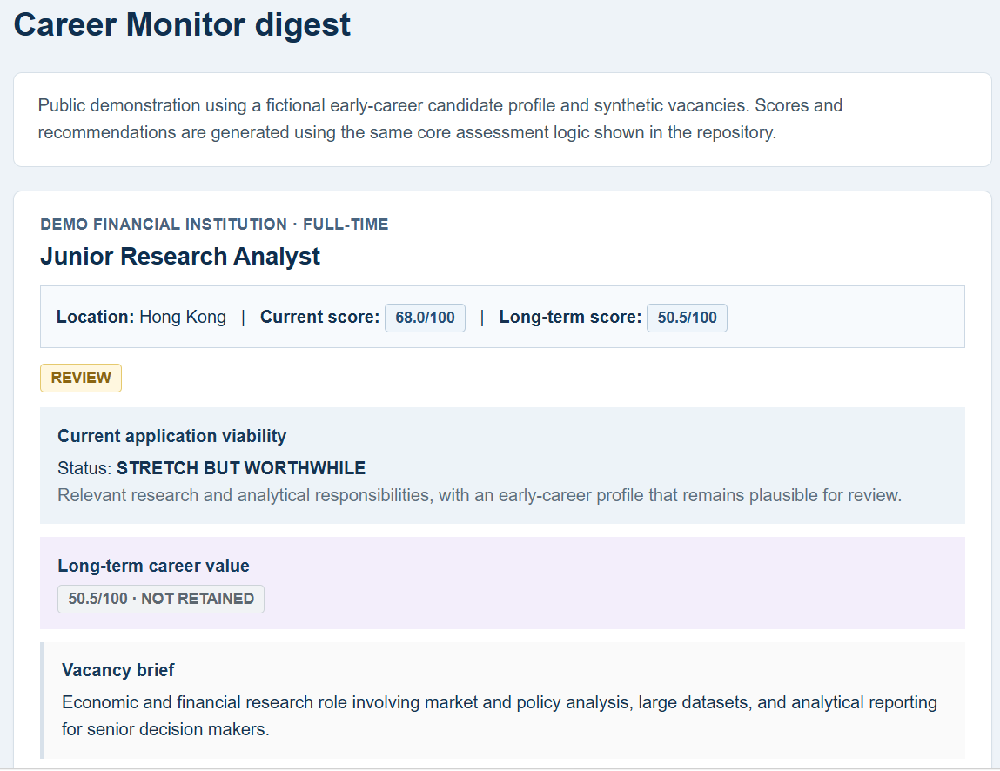
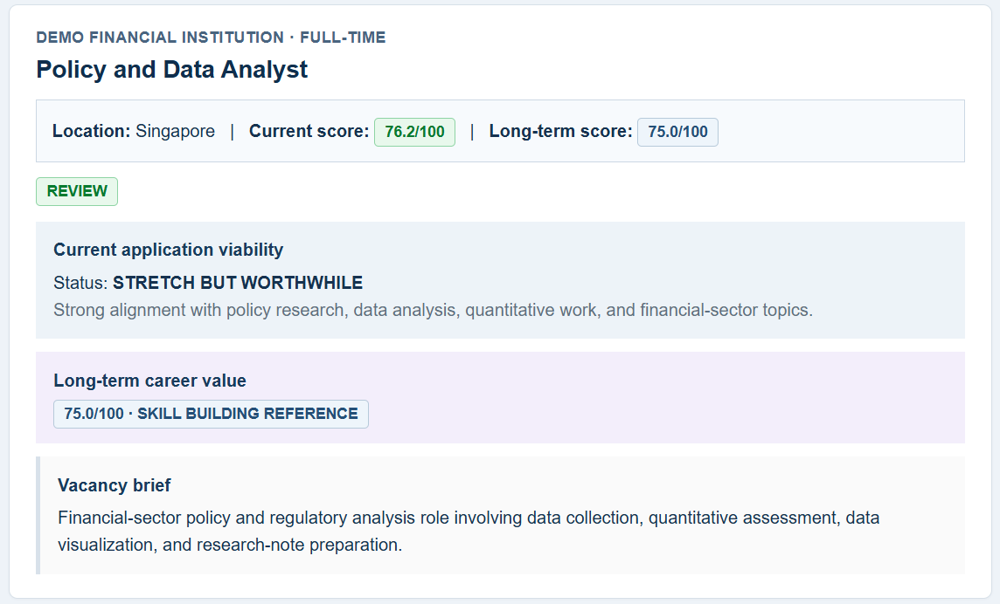

# Career Opportunity Monitor

Early-career job searches often involve a small set of "dream" institutions or companies that are highly attractive but difficult to enter.

The problem is that their opportunities are not always easy to discover. Vacancies may appear only on individual career pages, may not be consistently surfaced on platforms such as LinkedIn, and are easy to miss when there is limited time to monitor many organizations continuously.

I built **Career Opportunity Monitor** to make that process more systematic.

**[Try the interactive browser demo →](https://yanglyqx.github.io/career-opportunity-monitor-public/)**

Users can define organizations they want to follow, monitor newly published vacancies, and evaluate those opportunities against a candidate profile. Instead of simply collecting job postings, the system summarizes and scores each role to help answer two different questions:

* **What is realistically worth considering or applying to now?**
* **What roles are valuable signals for the career I may want to build toward?**

This distinction matters because some highly relevant roles may be too senior or require experience that an early-career candidate does not yet have. Rather than treating those roles as irrelevant, the monitor can retain them as longer-term career signals — evidence about recurring responsibilities, skills, qualifications, and experience requirements that can help inform future career planning.

The broader workflow is:

```text
Selected organizations
        ↓
Vacancy monitoring
        ↓
Job description parsing
        ↓
Candidate-role analysis
        ↓
Current application fit
        +
Long-term career relevance
        ↓
Candidate preference filter
        ↓
Prioritized opportunities
        +
Career signals
```

The public version of this repository uses a fictional candidate profile and synthetic vacancies so the core workflow can be demonstrated without exposing personal application data, credentials, or production state.

## What It Does

The monitor evaluates vacancy information across several dimensions, including:

* functional fit
* experience requirements
* eligibility and hard constraints
* seniority gaps
* critical capability gaps
* current application viability
* long-term career relevance

Each vacancy can then receive:

* a **Current Fit score**
* a **Current Status**
* a **Recommended Action**
* a separate **Long-Term Fit score**
* a **Long-Term Career label**
* key fit signals and major gaps

The aim is not simply to rank jobs by keyword similarity, but to turn vacancy information into a more useful career decision.

## Why Two Scores?

A single job-match score can be misleading.

A role may be highly relevant to someone's interests but require substantially more experience than they currently have. Conversely, an accessible role may offer little value for the career direction they want to build toward.

The monitor therefore separates two concepts.

### Current Fit

**Question:** How realistic and worthwhile is this opportunity for the candidate now?

Current-fit analysis considers factors such as:

* functional alignment
* experience requirements
* seniority
* eligibility
* hard qualification requirements
* critical capability gaps

The result is translated into a decision-oriented category and recommended action rather than relying only on a raw score.

### Long-Term Fit

**Question:** How useful is this role as evidence about a longer-term target career direction?

A role can therefore have:

```text
Low current fit
+
High long-term relevance
```

This is intentional.

For example, a senior regulatory or research role may not be realistic for an early-career applicant today, but it can still reveal the responsibilities, technical skills, institutional experience, and qualifications that repeatedly appear further along that career path.

## Candidate Preference Filtering

The public workflow can apply a configurable, deterministic preference filter
after assessment and before current recommendations are displayed. The filter
supports:

* excluding internships
* excluding clearly unrelated HR roles
* deprioritizing routine administrative or programme-execution work
* retaining programme roles when there is enough explicit substantive evidence
  for policy, climate finance, investment, regulation, research, financial
  analysis, risk, or technical programme design

Administrative and programme titles are not enough by themselves. A role is
deprioritized only when its duties or extracted keywords also contain configured
execution evidence. Likewise, an override requires at least the configured number
of distinct substantive terms. Every decision includes the matched rule and
evidence, making the result inspectable and reproducible.

Preferences live under `candidate.ordinary_opportunity_preferences`. The demo
contains a complete fictional example; a minimal configuration looks like:

```python
candidate = {
    "ordinary_opportunity_preferences": {
        "enabled": True,
        "internship": {
            "title_terms": ["intern", "internship"],
            "employment_terms": ["intern", "internship"],
        },
        "excluded_role_families": [
            {
                "id": "human_resources",
                "title_terms": ["human resources", "HR analyst", "HR operations"],
                "responsibility_terms": ["recruitment", "payroll"],
                "minimum_non_title_matches": 2,
            }
        ],
        "deprioritized_role_families": [
            {
                "id": "administrative_programme_execution",
                "title_terms": ["programme assistant", "programme coordinator"],
                "responsibility_terms": [
                    "general administration",
                    "grant management",
                    "donor reporting",
                    "implementation oversight",
                ],
                "preserve_terms": [
                    "policy",
                    "climate finance",
                    "investment",
                    "regulation",
                    "research",
                    "financial analysis",
                    "risk",
                    "technical programme design",
                ],
                "minimum_evidence_count": 2,
                "substantive_override_minimum": 2,
            }
        ],
    }
}
```

This layer changes only the current recommendation stream. It does not alter
assessment scores or long-term career relevance, and it has no location or
market-competitiveness rules. Set `enabled` to `False` to bypass it.

## Public Demo

The repository includes a small deterministic demo using:

* one fictional early-career candidate profile
* four synthetic vacancies
* editable candidate and vacancy input files
* no private database
* no production configuration
* no email credentials
* no network dependency

The four vacancies are designed to illustrate different cases:

| Vacancy                                | What it demonstrates                                            |
| -------------------------------------- | --------------------------------------------------------------- |
| Junior Research Analyst                | Relatively plausible current opportunity                        |
| Policy and Data Analyst                | Stronger current and long-term alignment                        |
| Senior Financial Regulation Specialist | Lower current feasibility but meaningful career-direction value |
| Operations Coordinator                 | Accessible role with weak career-direction alignment            |

### Interactive Browser Demo

The repository also includes a fully client-side interactive version:

**[Open the interactive demo](https://yanglyqx.github.io/career-opportunity-monitor-public/)**

Users can enter a candidate profile or draft one locally from a PDF or .docx
CV, paste a vacancy description, and run the same rule-based assessment directly
in the browser. The page also simulates a complete daily monitoring cycle across
eight fictional but realistic vacancies from different industries: users can
adjust notification thresholds, expand the extracted requirements and analysis,
inspect which roles are retained, and preview a detailed email digest. Python
runs locally through Pyodide: the page has no application backend, requires no
account or API key, and does not send candidate or vacancy inputs to a project
server.

### Example Output

```text
CAREER OPPORTUNITY MONITOR - PUBLIC DEMO

1. Junior Research Analyst
   Current Fit:    68.0/100
   Current Status: STRETCH BUT WORTHWHILE
   Recommended:    REVIEW
   Preference:     RETAINED
   Long-Term Fit:  50.5/100

2. Policy and Data Analyst
   Current Fit:    76.2/100
   Current Status: STRETCH BUT WORTHWHILE
   Recommended:    REVIEW
   Preference:     RETAINED
   Long-Term Fit:  75.0/100
   Long-Term Label: SKILL BUILDING REFERENCE

3. Senior Financial Regulation Specialist
   Current Fit:    56.2/100
   Current Status: MONITOR ONLY
   Recommended:    MONITOR
   Preference:     RETAINED
   Long-Term Fit:  69.5/100
   Long-Term Label: CAREER DIRECTION SIGNAL

4. Operations Coordinator
   Current Fit:    43.8/100
   Current Status: MONITOR ONLY
   Recommended:    MONITOR
   Preference:     DEPRIORITIZED
   Long-Term Fit:  9.0/100

CURRENT RECOMMENDATIONS AFTER PREFERENCE FILTER
   - Junior Research Analyst
   - Policy and Data Analyst
   - Senior Financial Regulation Specialist
```

The complete demo output is also stored in:

```text
sample_output/demo_output.txt
```

### Email Digest Preview

The production workflow can also deliver prioritized opportunities in an HTML email digest.





A standalone HTML preview is available at:

`sample_output/demo_digest.html`


## Running the Demo

Requires Python 3.11 or later.

```bash
pip install -e .
python demo.py
```

The demo uses synthetic data and runs locally without external services.

### Use Your Own Profile and Vacancies

The default command remains a zero-configuration demo. To personalize the
analysis, copy the example candidate file and edit the copy:

```bash
cp examples/candidate.example.yaml candidate.yaml
```

On Windows PowerShell:

```powershell
Copy-Item examples\candidate.example.yaml candidate.yaml
```

Then create a JSON file containing one or more vacancies. Each vacancy only
requires a title and the job-description text:

```json
[
  {
    "title": "Risk Analyst",
    "location": "Hong Kong",
    "employment_type": "Full-time",
    "cleaned_text": "Paste the vacancy description here."
  }
]
```

Run the same assessment workflow with the supplied files:

```bash
python demo.py --candidate candidate.yaml --jobs jobs.json
```

The personal `candidate.yaml` and `jobs.json` files are ignored by Git so that
local inputs are not accidentally committed. The example files remain
fictional and safe to publish.

## Core Workflow

At the code level, the public demo follows this simplified pipeline:

```text
Synthetic vacancy
      ↓
Requirement extraction
      ↓
Experience / eligibility analysis
      ↓
Candidate capability matching
      ↓
Current-fit scoring
      ↓
Long-term scoring
      ↓
Category + recommended action
      ↓
Candidate preference filtering
      ↓
Readable output
```

## Project Structure

```text
career-opportunity-monitor-public/
│
├── demo.py
├── pyproject.toml
├── README.md
│
├── examples/
│   └── candidate.example.yaml
│
├── fixtures/
│   ├── demo_jobs.json
│   └── browser_demo_jobs.json
│
├── docs/
│   ├── index.html
│   ├── app.js
│   └── styles.css
│
├── src/
│   └── job_monitor/
│       ├── analysis.py
│       ├── input_files.py
│       ├── models.py
│       ├── notification_content.py
│       ├── preference_filter.py
│       └── reporting.py
│
└── sample_output/
    └── demo_output.txt
```

## Core Components

### `analysis.py`

Contains the main vacancy-assessment logic, including:

* requirement extraction
* experience-feasibility analysis
* eligibility and hard-filter checks
* candidate capability matching
* current-fit scoring
* long-term scoring
* recommendation logic

### `models.py`

Defines the main data structures used for vacancies, configuration, requirement signals, hard-filter decisions, and vacancy assessments.

### `input_files.py`

Loads and validates editable candidate YAML and vacancy JSON files, then
converts them into the same data structures used by the assessment pipeline.

### `notification_content.py`

Contains utilities for converting vacancy and assessment information into concise, readable signals.

### `preference_filter.py`

Applies configurable, evidence-based candidate preferences to the current
recommendation stream without changing the underlying assessment or long-term
career evaluation.

### `reporting.py`

Provides report-rendering utilities for structured assessment results.

### `demo.py`

Loads the default fictional examples or user-supplied files, runs them through
the real assessment logic, and prints the resulting current-fit and long-term
evaluations.

## Production Workflow

This public repository is intentionally smaller than the private production implementation from which the core logic was developed.

The broader system supports a workflow such as:

```text
Institution career pages
        ↓
Source-specific ingestion
        ↓
Vacancy storage
        ↓
Job-description parsing
        ↓
Current-fit analysis
        ↓
Long-term analysis
        ↓
Application prioritization
        ↓
Opportunity notifications
        +
Career Signals
```

The production implementation also includes features such as:

* multiple source adapters for heterogeneous recruitment systems
* SQLite vacancy storage
* automated source ingestion
* delivery-history tracking and deduplication
* scheduled monitoring
* notification workflows
* longer-term Career Signals aggregation

These components are not all included in this repository because the goal of the public version is to demonstrate the core analytical workflow without publishing personal configuration, application history, credentials, or production state.

## Privacy

This repository does **not** contain:

* personal candidate profiles
* CVs or application materials
* production vacancy databases
* real notification history
* email addresses
* OAuth credentials or tokens
* local machine paths
* private career-planning records

All candidate and vacancy data used in the public demo is fictional or synthetic.

## Status

This repository is a minimal public demonstration of the Career Opportunity Monitor.

The current version supports both a zero-configuration fictional demo and
configurable local analysis without requiring users to edit Python source. The
focus remains on keeping the core decision logic transparent and reproducible
rather than packaging the project as a complete end-user application.
